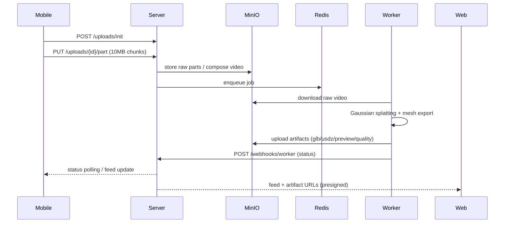

# Fashion3D Monorepo

Capture garments with a phone, reconstruct photoreal 3D assets via Gaussian splatting, and publish interactive posts across mobile and web. This repo contains the end-to-end MVP.

## Why pnpm workspaces?

We opted for **pnpm** because it deduplicates dependencies across apps (web + mobile share React 19 prerelease builds) while still coexisting with Poetry-managed Python services. npm would install duplicate trees per package. Workspaces let us publish shared UI, tsconfig, and types packages consumed by both clients.

## Repository layout

```
apps/
  mobile/   # Expo client
  web/      # Next.js app router front-end
  server/   # FastAPI REST backend
  worker/   # Reconstruction worker (RQ)
packages/
  ui/       # Tailwind + shadcn-inspired primitives
  types/    # Shared TypeScript contracts
  tsconfig/ # Base TS config
  eslint-config/
```

## Data flow



## 3D pipeline (CPU-friendly demo)

1. Extract and stabilise frames (OpenCV + LAB histogram balancing, TODO: MediaPipe face blur toggle).
2. Generate a surrogate point cloud for preview, export placeholder `model.glb` + stub `model.usdz`.
3. Compute heuristics (`quality.json`) for PSNR/SSIM/completeness scoring.
4. Upload outputs to `artifacts/{job_id}/` in MinIO (or local fallback) and fire signed webhook.
5. GPU path (see `pipeline.py` TODOs) swaps in real Gaussian Splatting/xatlas UV unwrap when hardware is present.

## Standing up the stack

```bash
cp apps/server/.env.example apps/server/.env
cp apps/worker/.env.example apps/worker/.env
cp apps/web/.env.example apps/web/.env
cp apps/mobile/.env.example apps/mobile/.env

make docker-up  # postgres + redis + minio + api + worker
pnpm install
```

- Web app: `pnpm --filter web dev` ➜ http://localhost:3000
- Mobile app: `pnpm --filter mobile start` (Expo)
- API docs: http://localhost:8000/docs

GPU mode:

```bash
docker compose -f docker-compose.yml -f compose.gpu.yml up -d
```

Seed demo data:

```bash
cd apps/server
poetry run python app/scripts/seed.py
```

Download sample capture:

```bash
cd apps/worker
poetry run python scripts/download_sample.py --output sample.mp4
```

## Services

| Service  | Port | Notes |
|----------|------|-------|
| server   | 8000 | FastAPI, Prometheus metrics at `/metrics` |
| worker   | -    | RQ worker consuming `fashion3d` queue |
| postgres | 5432 | Alembic-managed schema |
| redis    | 6379 | Job queue + pub/sub |
| minio    | 9000/9001 | S3-compatible storage (raw + artifacts) |

## Testing

```bash
# Python
(cd apps/server && poetry run pytest)
(cd apps/worker && poetry run pytest)

# Web & mobile
pnpm --filter web test
pnpm --filter mobile test
```

CI workflow lives in `.github/workflows/ci.yml` (Node lint/test + Python pytest).

## Security & privacy highlights

- JWT auth (passwords hashed via bcrypt).
- Free tier enforced by `scan_quotas` (HTTP 402 beyond 3 scans/month).
- Face blur + EXIF scrubbing marked with `TODO` for integration with MediaPipe/FFmpeg filters.
- Soft delete on posts/artifacts for GDPR-friendly retention + future GC.

## Competitors & differentiation

- **Luma AI**, **Polycam**, **RealityScan** – excellent capture but siloed publishing. Fashion3D stitches the pipeline: *create → view → engage → monetise* with social feed, metrics, and upcoming commerce hooks.

## Troubleshooting

| Issue | Fix |
|-------|-----|
| `minio` not reachable | Ensure ports 9000/9001 are free and credentials match `.env`; worker falls back to filesystem locally. |
| Tests hang on SQLite | Delete `apps/server/test.db` (pytest fixture recreates schema). |
| Expo chunk upload fails on large files | Increase `EXPO_PUBLIC_CHUNK_SIZE` or ensure device has RAM; TODO: stream upload implementation. |

## Roadmap / TODO

- Swap stub USDZ exporter with RealityKit/pyusd pipeline.
- Integrate MediaPipe face segmentation for upload-side blurring + FFmpeg EXIF removal.
- Add commerce hooks (Stripe Checkout) and follower graph for visibility controls.
- Implement proper Gaussian Splatting (Kaolin or gsplat) with mesh decimation + KTX2 compression.
